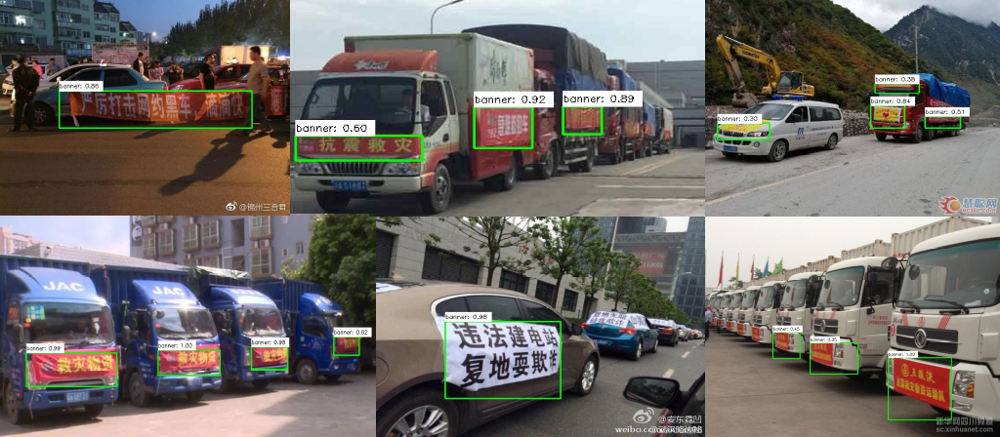

# caffe-ssd训练自己的数据
## 1.配置环境
参考上一篇博客：[cuda:9.0-cudnn7-devel-ubuntu16.04 python3 docker 安装 caffe](https://github.com/South2North/install_caffe)
## 2.准备数据
### 2.1 获取数据
这次是要做一个车身条幅检测的项目。大部分数据从百度图片[爬取](https://github.com/kong36088/BaiduImageSpider)，少量通过微博或者截取视频帧获取。因为违规的车身条幅数据较难获取，所以大部分图片都是一些运送救灾物资的车辆。

### 2.2 标注数据
使用[labelImg](https://github.com/tzutalin/labelImg)对图片进行标注。因为检测类别只有一个，所以设置默认标签和自动保存之后还是标的比较快的。这里有两个地方要注意：
- 因为打开图片进行标记时默认全屏（也可能是设置的问题？）而一些小图片上面的物体本来就看不清，强行放大之后进行标记的话可能对模型的准确率有影响（没有标记difficult属性），所以我在标记的时候都是先将图片显示为原图大小。可以修改`labelImg.py`设置显示原图大小的快捷键。
- 因为标记框都是水平的矩形，而只要条幅倾斜一点，标记框内大部分区域都是没有物体的。所以后面**数据增广如果有旋转操作的话，之前的标记框就不适用了，只能重新标记**。这里建议先做旋转的增广，统一标注之后再做其他的增广。

### 2.3 数据增广
使用这个[repo](https://github.com/Paperspace/DataAugmentationForObjectDetection)做数据增广。我做的增广包括小角度旋转、水平镜像和修改hsv值。根据里面的`quick-start.ipynb`很容易修改适来配自己的数据。最后得到训练集3041张和测试集605张。截取部分代码：
```python
try:
    import xml.etree.cElementTree as ET
except ImportError:
    import xml.etree.ElementTree as ET
# 解析xml文件
def getAnnotBoxLoc(AnotPath):
    tree = ET.ElementTree(file=AnotPath)
    root = tree.getroot()
    ObjectSet=root.findall('object')
    ObjBndBoxSet={}
    for Object in ObjectSet:
        ObjName=Object.find('name').text
        BndBox=Object.find('bndbox')
        x1 = float(BndBox.find('xmin').text)
        y1 = float(BndBox.find('ymin').text)
        x2 = float(BndBox.find('xmax').text)
        y2 = float(BndBox.find('ymax').text)
        BndBoxLoc=[x1,y1,x2,y2]
        if ObjBndBoxSet.__contains__(ObjName):
            ObjBndBoxSet[ObjName].append(BndBoxLoc)
        else:
            ObjBndBoxSet[ObjName]=[BndBoxLoc]
    if len(ObjBndBoxSet.keys()) == 1:
        return np.array(ObjBndBoxSet[ObjName])
    else:
        return ObjBndBoxSet

data_path = ''
xml_path = ''
aug_data_path = ''
aug_xml_path = ''
train_image_list = os.listdir(data_path)
print(len(train_image_list))

for image_name in train_image_list:
    img = cv2.imread(os.path.join(data_path, image_name))
    bboxes = getAnnotBoxLoc(os.path.join(xml_path, image_name.split('.')[0]+'.xml'))
    img_, bboxes_ = RandomHorizontalFlip(1)(img.copy(), bboxes.copy())
    bboxes_.astype(np.int64)
#     保存图片
    cv2.imwrite(os.path.join(aug_data_path, image_name.split('.')[0]+'_hf.jpg'), img_)
#     保存标注
    tree = ET.ElementTree(file=os.path.join(xml_path, image_name.split('.')[0]+'.xml'))
    root = tree.getroot()
    
    name = root.find('filename')
    name.text = image_name.split('.')[0]+'_hf.jpg'
    
    objectSet = root.findall('object')
    for i,obj in enumerate(objectSet):
        bndBox = obj.find('bndbox')
        bndBox.find('xmin').text = str(int(bboxes_[i][0]))
        bndBox.find('ymin').text = str(int(bboxes_[i][1]))
        bndBox.find('xmax').text = str(int(bboxes_[i][2]))
        bndBox.find('ymax').text = str(int(bboxes_[i][3]))
    tree.write(os.path.join(aug_xml_path, image_name.split('.')[0]+'_hf.xml'))
```

## 3.处理数据
在caffe的data目录下新建banner（自己的数据集）和VOCdevkit两个目录，使data目录结构如下：
```sh
.
├── banner
├── cifar10
├── coco
├── ilsvrc12
├── ILSVRC2016
├── mnist
├── VOC0712
└── VOCdevkit
    └── banner
        ├── Annotations（所有的标注文件）
        ├── ImageSets
        │   └── Main（里面有test.txt和trainval.txt两个文件，文件内容分别是测试集和训练集全部图片的文件名，每个文件名占一行，一般由matlab脚本生成，这里是我自己分的）
        ├── JPEGImages（保存所有的图片）
        └── lmdb（最后生成的lmdb文件存放目录）
            ├── banner_test_lmdb
            └── banner_trainval_lmdb
```
data/banner下包含以下文件：
- labelmap_voc_banner.prototxt
```sh
item {
  name: "none_of_the_above"
  label: 0
  display_name: "background"
}
item {
  name: "banner"
  label: 1
  display_name: "banner"
}
```

- test_name_size.txt(由`create_list_banner.sh`生成)
```sh
test0259 360 480
test0375 1457 1080
test0118 350 500
test0056 750 1334
...
```

- test.txt(同上)
```sh
banner/JPEGImages/test0259.jpg banner/Annotations/test0259.xml
banner/JPEGImages/test0375.jpg banner/Annotations/test0375.xml
banner/JPEGImages/test0118.jpg banner/Annotations/test0118.xml
banner/JPEGImages/test0056.jpg banner/Annotations/test0056.xml
...
```

- trainval.txt(同上)
```sh
banner/JPEGImages/train_2878.jpg banner/Annotations/train_2878.xml
banner/JPEGImages/train_2904.jpg banner/Annotations/train_2904.xml
banner/JPEGImages/train_0786.jpg banner/Annotations/train_0786.xml
banner/JPEGImages/train_1818.jpg banner/Annotations/train_1818.xml
...
```

[create_list_banner.sh](./create_list_banner.sh)由data/VOC0712中的create_list.sh（看得懂大概的意思，有些细节还不清楚）修改而来，修改之后mv到data/banner下。执行前ImageSets/Main中需要有test.txt和trainval.txt两个文件。执行后会生成test.txt、trainval.txt、test_name_size.txt和trainval_name_size.txt4个文件。

修改同目录下的create_data.sh得到[create_data_banner.sh](./create_data_banner.sh)，生成用于训练的lmdb文件。

## 4.训练
下载SSD页面的预训练模型：07++12+COCO: [SSD300*](https://drive.google.com/file/d/0BzKzrI_SkD1_TkFPTEQ1Z091SUE/view)（07++12表示用10k的trainval2007+test2007和16k的trainval2012作为训练集（07++12），test2012作为测试集）。下载之后将VGGNet文件夹整个移到model目录下面。
修改里面的finetune_ssd_pascal.py，包括
- 文件路径
- defaultbox宽高比（适配条幅）
- mbox_source_layers的后缀（因为原来是在21类训练，自己的数据集只有两类，使用不同的名字表示不读取这些层（mbox_source_layers）的参数）
- 类别数和训练参数

**因为原版ssd的脚本是在python2下写的，需要修改一些地方适配python3：**
- finetune_ssd_pascal.py: 在Python 3中，range()与xrange()合并为range()。因此修改文件中的xrange为range
- finetune_ssd_pascal.py: `test_iter = int(num_test_image/test_batch_size)`
- model_libs.py: 注释掉文件中，函数UnpackVariable定义中与assert相关的语句: `assert len > 0`
- model_libs.py: 将文件中类似pad=int((3+(dilation-1)*2)-1)/2的语句的/2改为//2，一共3句(python中/的结果都是float，//才是int)

使用在07++12+COCO上的预训练模型能**显著**加快模型训练速度，比如迭代200次就能达到59.8%的mAP。最后模型的mAP为85.8%，共迭代44000次。

完整[finetune_ssd_pascal.py](./finetune_ssd_pascal.py)文件

## 5.测试
修改caffe/examples中的ssd_detect.ipynb，在图片上标记检测结果并保存:
```python
# 返回检测结果
def get_result(images_dir_path):
    images_list = os.listdir(images_dir_path)
    # 对每张图片
    res_dict = dict()
    for image_name in images_list:
        image = caffe.io.load_image(os.path.join(images_dir_path, image_name))
        transformed_image = transformer.preprocess('data', image)
        net.blobs['data'].data[...] = transformed_image

        # Forward pass.
        detections = net.forward()['detection_out']

        # Parse the outputs.
        det_label = detections[0,0,:,1]
        det_conf = detections[0,0,:,2]
        det_xmin = detections[0,0,:,3]
        det_ymin = detections[0,0,:,4]
        det_xmax = detections[0,0,:,5]
        det_ymax = detections[0,0,:,6]

        # Get detections with confidence higher than 0.6.
        top_indices = [i for i, conf in enumerate(det_conf) if conf >= 0.3]

        top_conf = det_conf[top_indices] 
        top_xmin = det_xmin[top_indices] * image.shape[1]
        top_ymin = det_ymin[top_indices] * image.shape[0]
        top_xmax = det_xmax[top_indices] * image.shape[1]
        top_ymax = det_ymax[top_indices] * image.shape[0]
        
        res = np.stack([top_conf, top_xmin, top_ymin, top_xmax, top_ymax], -1).reshape(len(top_conf), 5)
        res_dict[image_name] = res
        
    return res_dict

anno_data = get_result('')

import cv2
dir = ""
images_list = os.listdir(dir)
for image_name in images_list:
    res = anno_data[image_name]
    image = cv2.imread(os.path.join(dir, image_name))
    for data in res:
        pt1 = int(data[1]), int(data[2])
        pt2 = int(data[3]), int(data[4])
        pt_txt = int(data[1]), int(data[2])-6
        pt_bg_tl = int(data[1]), int(data[2])-20
        pt_bg_br = int(data[1]) + 90, int(data[2])
        # image = cv2.rectangle(image.copy(), pt1, pt2, (0,255,0), int(max(image.shape[:2])/200))
        image = cv2.rectangle(image.copy(), pt1, pt2, (0,255,0), 2)
        image = cv2.rectangle(image.copy(), pt_bg_tl, pt_bg_br, (255, 255, 255), -1)
        cv2.putText(image, 'banner: %.2f' % data[0], pt_txt, cv2.FONT_HERSHEY_SIMPLEX, 0.4, (0, 0, 0), 1)
        os.chdir("")
    cv2.imwrite(image_name, image)
```
测试效果图：
<div align="center">

</div>
测试效果图（GIF）：
<div align="center">

</div>

## 参考
1. https://hyzhan.github.io/2017/05/21/2017-05-21-%E7%94%A8SSD%E8%AE%AD%E7%BB%83%E8%87%AA%E5%B7%B1%E7%9A%84%E6%95%B0%E6%8D%AE%E9%9B%86(VOC2007%E6%A0%BC%E5%BC%8F)/
2. https://blog.csdn.net/Jdk_yxs/article/details/77851548
3. https://blog.nickwhyy.top/installssd/
